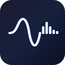
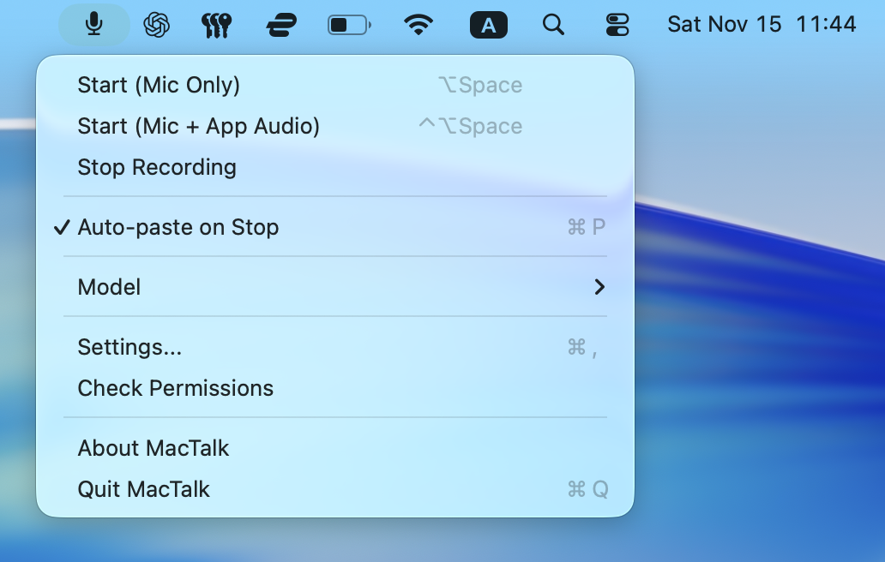
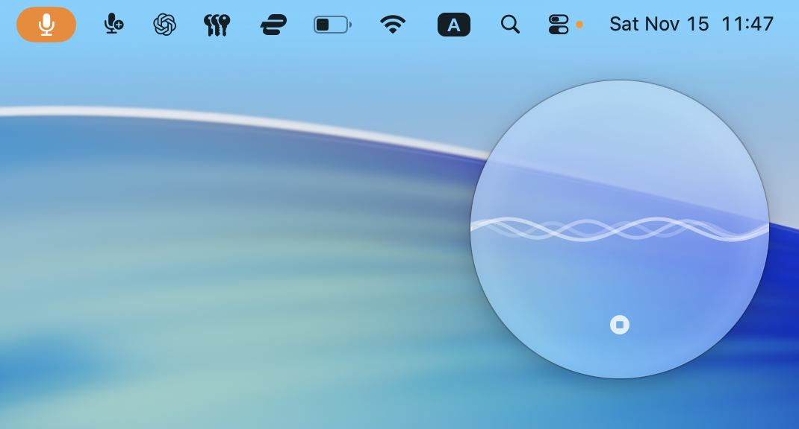

  

# MacTalk

> A native macOS app for local voice transcription powered by Whisper and Parakeet

MacTalk is a privacy-focused, menu bar app that transcribes your voice in real-time. Choose between Whisper for accuracy or Parakeet for blazing-fast, real-time streaming transcription. All processing happens locally on your Mac with Metal-accelerated inference—no cloud, no network calls, no compromises.

---

## Features

- **Dual Engine Support** - Choose Whisper for accuracy or Parakeet for ultra-fast real-time streaming
- **Real-time Transcription** - Streaming inference with live results as you speak
- **Dual Capture Modes** - Mic-only or mic + app audio (for calls/meetings)
- **100% Local Processing** - Zero network calls, complete privacy
- **Metal Accelerated** - Optimized for Apple Silicon
- **Swift 6 Concurrency** - Built with Swift 6 strict concurrency for thread-safe, responsive performance
- **Menu Bar App** - Lightweight, always accessible
- **Multiple Models** - Choose from tiny (fast) to large (accurate)
- **Auto-Paste** - Transcripts copied to clipboard and optionally pasted
- **Customizable Hotkeys** - Configure your own keyboard shortcuts for hands-free control

---

## Screenshots

### Menu Bar Interface

*Menu bar dropdown with recording modes, settings, and quick controls. Keyboard shortcuts for all major actions.*

### Recording in Action

*Live HUD overlay during transcription showing real-time waveform visualization and audio levels.*

---

## Requirements

- macOS 14.0 (Sonoma) or later
- Apple Silicon (M1 or newer) recommended
- 8 GB RAM minimum

---

## Installation

### Download Release

1. Download `MacTalk-v1.1.0.dmg` from [Releases](https://github.com/benedict2310/MacTalk/releases)
2. Open the DMG and drag `MacTalk.app` to your Applications folder
3. Right-click and select "Open" (first launch only)
4. Grant permissions when prompted (Microphone, Screen Recording, Accessibility)
5. Select a model to download (recommended: small)

### Build from Source

See [docs/development/SETUP.md](docs/development/SETUP.md) for build instructions.

---

## Usage

1. Click the menu bar icon and select a transcription mode
2. For call transcription, choose "Mic + App Audio" and select the app
3. Press the hotkey or click "Start" to begin recording
4. Speak - your words appear in real-time in the HUD overlay
5. Press the hotkey or click "Stop" when done
6. Transcript is automatically copied to clipboard

---

## Engines & Models

MacTalk supports two transcription engines:

### Parakeet (Recommended for speed)

Ultra-fast streaming transcription with real-time results. Words appear instantly as you speak.

| Model | Size | Speed | Use Case |
|-------|------|-------|----------|
| Parakeet TDT 0.6B | ~600 MB | Instant | Real-time streaming, live dictation |

### Whisper (Recommended for accuracy)

High-accuracy batch transcription with multiple model sizes:

| Model | Size | Speed | Use Case |
|-------|------|-------|----------|
| tiny | ~32 MB | Fastest | Quick dictation |
| base | ~60 MB | Very Fast | Everyday use |
| small | ~190 MB | Fast | Recommended default |
| medium | ~539 MB | Moderate | High accuracy |
| large-v3-turbo | ~574 MB | Slower | Maximum accuracy |

Models download automatically when selected. No manual setup required.

---

## Privacy

- **100% local processing** - No data ever leaves your Mac
- **No telemetry** - No analytics or tracking
- **Open source** - Review the code yourself

Microphone and Screen Recording permissions are required for transcription. Accessibility permission enables auto-paste.

---

## FAQ

### Q: Does MacTalk work offline?
**A:** Yes. Once models are downloaded, no network connection is required for transcription.

### Q: Which engine should I use?
**A:** Use **Parakeet** for real-time streaming where words appear instantly as you speak—ideal for live dictation. Use **Whisper** when you need maximum accuracy or multilingual support. Start with Whisper `small` for balanced speed and accuracy.

### Q: Can I transcribe calls from Zoom/Teams/FaceTime?
**A:** Yes, using Mode B (Mic + App Audio). Requires Screen Recording permission.

### Q: Does it work with languages other than English?
**A:** Yes, Whisper supports 99+ languages. The app defaults to English for best accuracy.

### Q: How is this different from macOS Dictation?
**A:**
- MacTalk works completely offline (Apple Dictation requires network for best quality)
- Supports app audio capture for transcribing calls
- Choice of multiple models (speed vs. accuracy tradeoff)
- Privacy-focused with no telemetry or network calls

---

## Technology

- Built with Swift 6 and AppKit for native macOS performance with strict concurrency
- Powered by [whisper.cpp](https://github.com/ggerganov/whisper.cpp) with Metal acceleration
- Parakeet engine via [FluidAudio](https://github.com/FluidInference/FluidAudio) for real-time streaming
- Based on [OpenAI Whisper](https://github.com/openai/whisper) and [NVIDIA Parakeet](https://catalog.ngc.nvidia.com/orgs/nvidia/teams/canary/models/parakeet-tdt-0.6b-v2)

---

## License

MIT License - see [LICENSE](LICENSE) for details.

---

## Support

- **Issues:** [GitHub Issues](https://github.com/benedict2310/MacTalk/issues)
- **Discussions:** [GitHub Discussions](https://github.com/benedict2310/MacTalk/discussions)
