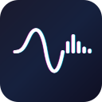
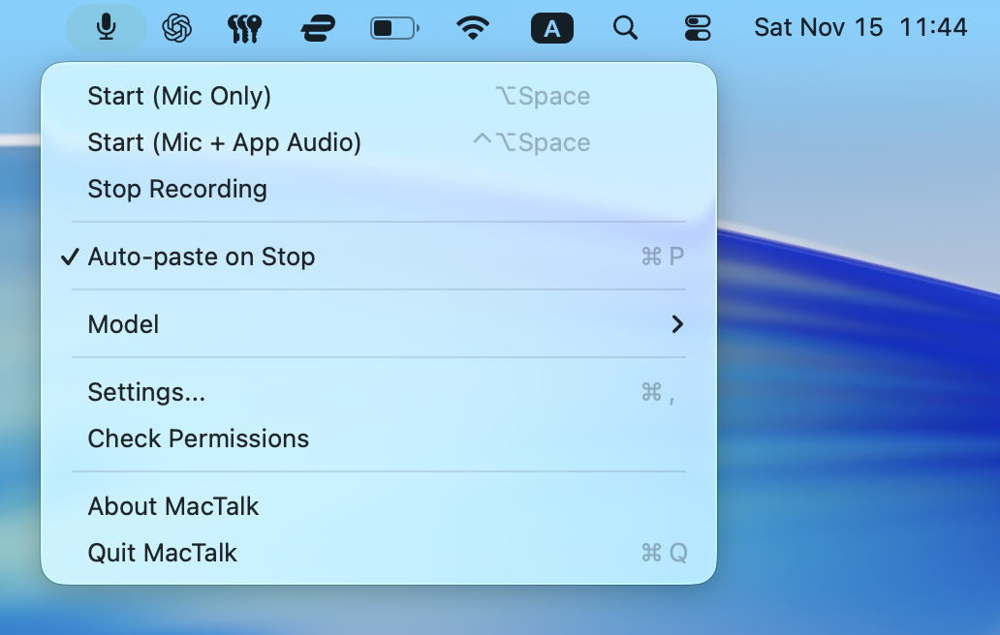
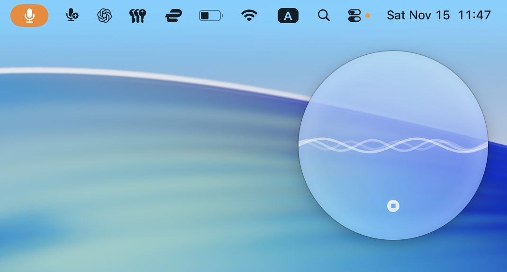

  

# MacTalk

> A native macOS app for local voice transcription powered by Whisper and Parakeet

MacTalk is a menu-bar app with two local ASR providers: Whisper and Parakeet. After a model is provisioned, transcription runs on the Mac; model downloaders use network URLs and verify catalog SHA-256 values before installation. See the dated [verified status baseline](docs/STATUS.md) for command results and external release gates.

The repository targets macOS 26.0, Swift 6.0, and FluidAudio 0.15.5 as declared in `project.yml`. This README does not claim notarization, hardware/TCC validation, or a universal offline installation.

> 📝 **Read the full story:** [MacTalk Was My ASR Playground — and It Led to Ora](https://futurelab.studio/blog/mactalk-led-to-ora/) · [Project page on Futurelab Studio](https://futurelab.studio/mactalk/)

---

## Features

- **Dual Engine Support** - Choose Whisper for accuracy or Parakeet for ultra-fast real-time streaming
- **Incremental transcription** - Whisper processes bounded chunks; Parakeet uses its provider-specific finalization path
- **Dual Capture Modes** - Mic-only or mic + app audio (for calls/meetings)
- **Local Inference** - Captured audio is processed locally after model provisioning; model downloads are explicit network operations
- **Metal Accelerated** - Optimized for Apple Silicon
- **Swift 6 Concurrency** - Built with Swift 6 strict concurrency for thread-safe, responsive performance
- **Menu Bar App** - Lightweight, always accessible
- **Multiple Models** - Choose from tiny (fast) to large (accurate)
- **Auto-Paste** - Transcripts copied to clipboard and optionally pasted
- **Release tooling** - Archive, signing, notarization, and verification scripts with explicit Apple/GitHub prerequisites
- **Customizable Hotkeys** - Configure your own keyboard shortcuts for hands-free control

---

## Screenshots

### Menu Bar Interface

*Menu bar dropdown with recording modes, settings, and quick controls. Keyboard shortcuts for all major actions.*

### Recording HUD

*Compact HUD while recording, with elapsed time and live activity indicator.*

*Expanded HUD during transcription with partial text preview and one-click stop control.*

---

## Requirements

- macOS 26.0 or later
- Apple Silicon (M1 or newer) recommended
- 8 GB RAM minimum

---

## Installation

### Download Release

1. Download the versioned `MacTalk-<version>.dmg` from [Releases](https://github.com/benedict2310/MacTalk/releases)
2. Open the DMG and drag `MacTalk.app` to your Applications folder
3. Right-click and select "Open" the first time you launch it
4. Grant permissions when prompted:
   - **Microphone** when you start recording
   - **Screen Recording** when you use Mic + App Audio
   - **Accessibility** only if you enable auto-paste
5. Select a model to download (recommended: Whisper `small` or Parakeet for live streaming)

### Build from Source

See [docs/development/SETUP.md](docs/development/SETUP.md) for build instructions. Maintainers should follow the [reproducible archive/notarization release workflow](docs/deployment/RELEASE_WORKFLOW.md) for signed DMGs.

---

## Usage

1. Click the menu bar icon and select a transcription mode
2. For call transcription, choose "Mic + App Audio" and select the app
3. Press the hotkey or click "Start" to begin recording
4. Speak - your words appear in real-time in the HUD overlay
5. Press the hotkey or click "Stop" when done
6. Transcript is automatically copied to clipboard

---

## Engines & Models

MacTalk supports two transcription engines:

### Parakeet (Recommended for speed)

FluidAudio-backed local transcription. Provider lifecycle and finalization are coordinated separately from Whisper; see `ASREngine.swift` and the status baseline for validated behavior.

| Model | Size | Speed | Use Case |
|-------|------|-------|----------|
| Parakeet TDT 0.6B | ~600 MB | Instant | Real-time streaming, live dictation |

### Whisper (Recommended for accuracy)

High-accuracy batch transcription with multiple model sizes:

| Model | Size | Speed | Use Case |
|-------|------|-------|----------|
| tiny | ~32 MB | Fastest | Quick dictation |
| base | ~60 MB | Very Fast | Everyday use |
| small | ~190 MB | Fast | Recommended default |
| medium | ~539 MB | Moderate | High accuracy |
| large-v3-turbo | ~574 MB | Slower | Maximum accuracy |

Models download automatically when selected. No manual setup required.

---

## Privacy

- **Local transcription path** - Captured audio is not sent to a cloud ASR provider by the transcription pipeline; model provisioning uses the documented downloaders
- **No telemetry** - No analytics or tracking
- **Open source** - Review the code yourself

Microphone and Screen Recording permissions are required for transcription. Accessibility permission enables auto-paste.

---

## FAQ

### Q: Does MacTalk work offline?
**A:** Once a model is downloaded and verified, the transcription path can run without a network connection. Model provisioning itself requires network access unless the artifact is already present.

### Q: Which engine should I use?
**A:** Select the provider for your workload. Whisper exposes incremental chunk processing and multilingual catalog models; Parakeet is backed by FluidAudio. Do not infer latency or accuracy from this README—hardware/model measurements are not part of the current baseline.

### Q: Can I transcribe calls from Zoom/Teams/FaceTime?
**A:** Yes, using Mode B (Mic + App Audio). Requires Screen Recording permission.

### Q: Does it work with languages other than English?
**A:** Yes, Whisper supports 99+ languages. The app defaults to English for best accuracy.

### Q: How is this different from macOS Dictation?
**A:**
- MacTalk works completely offline (Apple Dictation requires network for best quality)
- Supports app audio capture for transcribing calls
- Choice of multiple models (speed vs. accuracy tradeoff)
- Privacy-focused with no telemetry or network calls

---

## Technology

- Built with Swift 6 and AppKit for native macOS performance with strict concurrency
- Powered by [whisper.cpp](https://github.com/ggerganov/whisper.cpp) with Metal acceleration
- Parakeet engine via [FluidAudio](https://github.com/FluidInference/FluidAudio) for real-time streaming
- Based on [OpenAI Whisper](https://github.com/openai/whisper) and [NVIDIA Parakeet](https://catalog.ngc.nvidia.com/orgs/nvidia/teams/canary/models/parakeet-tdt-0.6b-v2)

---

## License

MIT License - see the root [MIT License](./LICENSE) for details.

---

## Support

- **Issues:** [GitHub Issues](https://github.com/benedict2310/MacTalk/issues)
- **Discussions:** [GitHub Discussions](https://github.com/benedict2310/MacTalk/discussions)
